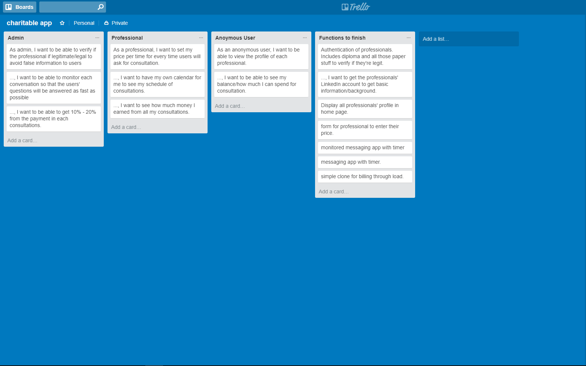
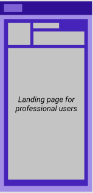
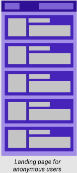

# Refer App

Refer is a mobile app for people to be able to consult with professionals (e.g. All types of, Doctors, Engineers, Architect, and more.) at the comfort of their homes.

## Table of Contents

- [Team](#team)
- [Purpose](#purpose)
- [Problem](#problem)
- [User Stories](#user-stories)
- [Wireframe](#wireframe)
- [Tools and Methodologies](#tools-and-methodologies)
- [Usage](#usage)
- [Future Improvements](#future-improvements)


### Team

| Contributor | Github | Portfolio |
| --- | --- | --- |
| Mark Kenneth Lim | [KennethLim119](https://github.com/KennethLim119) | [kennethlim119.github.io/](https://kennethlim119.github.io/) |
| JD Mateo | [JayDeehM](https://github.com/JayDeehM) | [jaydeeh.herokuapp.com](https://jaydeeh.herokuapp.com) |
| Rodolf Rodriguez| [itsmerodolf](https://github.com/itsmerodolf) | [itsmerodolf.github.io/](https://itsmerodolf.github.io/) |

### Purpose
The purpose of this app is to help people to have an easier way to communicate with the professionals.
### Problem
Just imagine you would want to ask a professional for cunsultation but the location and time you and the professional have is inconvenient. With this, it hinders you to gain the knowledge you would want to obtain and the professional to help you.
### User Stories


### Wireframe
Landing page for professional users and their profile.<br /><br />
<br /><br />
Landing page for communcation between the anonymous users and the professional users.<br /><br />
<br /><br />
Landing page for anonymous users.<br /><br />


### Tools and Methodologies
This applications helped us building the App

- [Github](https://github.com/JayDeehM/Refer-app)
- [Trello](https://trello.com/b/j4h7kXcd/charitable-app)
- [Figma](https://www.figma.com/file/TYjOeqs6mN8i72A1C9Xj0TN2/THE-Reaction-app)

How did we communicate? we used [Slack](https://slack.com/) and [Facebook](https://facebook.com).

### Usage
These are the steps on how to run the app.

1. Go to the link below which will lead you to the github repository

    https://github.com/JayDeehM/Refer-app

2. Clone or download the repository 

3. install dependencies

```
$ npm install
$ npm start
```

Visit http://localhost:3000/

### Future Improvements

- Adding of calendars to make the schedule 
